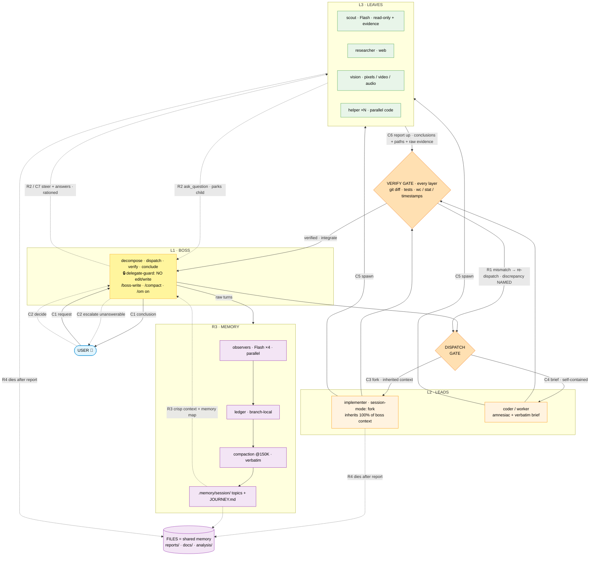

---
tags:
  - kash
  - workflow
  - mermaid
---

# KASH workflow — flow diagram (Mermaid)

> Final state of the boss → leads → leaves tree with fork inheritance,
> observational memory, comms (C#) and loops (R#). Companion:
> `~/Desktop/kash-commands-and-tree.md`.

## Flow

## Channels (comms)

| # | Channel | Direction | Nature |
|---|---|---|---|
| C1 | user ↔ boss | ↔ | interactive chat — the only human channel |
| C2 | escalation | boss ↔ user | unanswerable questions routed up, never guessed |
| C3 | fork inheritance | boss → implementer | 100% of built-up context, one hop only |
| C4 | brief | boss/lead → child | verbatim, self-contained (goal · paths · constraints · deliverable · out-of-scope · consult policy) |
| C5 | spawn | parent → child | `subagent` tool, fire-and-forget |
| C6 | report | child → parent | conclusions + file paths + raw evidence + "what remains" |
| C7 | steering / answers | parent → child | `subagent_message` — wakes parked children |
| C8 | files | ↔ all layers | the shared memory — content never relayed through messages |

## Loops

| # | Loop | What it catches |
|---|---|---|
| R1 | verify → re-dispatch | wrong/unverified results — killed at the layer below |
| R2 | ask/answer (rationed) | ambiguity — parked child wakes on reply; short tasks never consult |
| R3 | observers → ledger → compaction → .memory | context rot — boss stays crisp indefinitely |
| R4 | spawn → work → report → die → continue | context pollution — implementation never contaminates the boss |

**Constraints:** width unlimited (3–4 concurrent per parent) · depth FIXED at 3 ·
delegation strictly downward (hard-enforced: self-spawn and lead→lead blocked).
